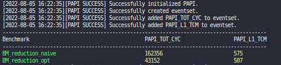

# pretty-papi
The pretty-papi header library allows you to benchmark  [PAPI](https://icl.utk.edu/papi/) hardware counters in your code with a similar interface and similar output as [Google Benchmark](https://github.com/google/benchmark).

## Usage
Just include the headerlibrary
```cpp
#include "prettypapi.hpp"
```

Then register your [PAPI](https://icl.utk.edu/papi/) hardware counters using the `REGISTER_BENCHMARK` macro e.g.
```cpp
REGISTER_PAPI(PAPI_TOT_CYC, PAPI_L1_TCM);
```
Define a function that executes the code to measure with the following signature:
```cpp
void some_name(papi::event_code eventset, papi::papi_counter *counter)
```
The code you want to measure should be executed between the macros `PAPI_START` and `PAPI_OVER`. Initializations and clean ups you want to exclude from the benchmark can be define within the function before and after those macros respectively.  
At the end register your functions by using the `PAPI_MAIN` macro.
```cpp
PAPI_MAIN(some_name);
```

## Example
The following code provides a full example and can be found [here](example.cpp).
```cpp
#include "benchmark_function.hpp"
#include "prettypapi.hpp"

#define VEC_SIZE 3200

REGISTER_PAPI(PAPI_TOT_CYC, PAPI_L1_TCM);

void BM_reduction_naive(papi::event_code eventset, papi::papi_counter *counter) {
    std::vector<double> vec;
    initialize_vector(vec, VEC_SIZE);

    PAPI_START;
    { double sum = reduction_naive(vec); }
    PAPI_OVER;
}

void BM_reduction_opt(papi::event_code eventset, papi::papi_counter *counter) {
    std::vector<double> vec;
    initialize_vector(vec, VEC_SIZE);

    PAPI_START;
    { double sum = reduction_opt(vec); }
    PAPI_OVER;
}

PAPI_MAIN(BM_reduction_naive, BM_reduction_opt);
```

## Output
The example from above on my machine gives me the following output:  
